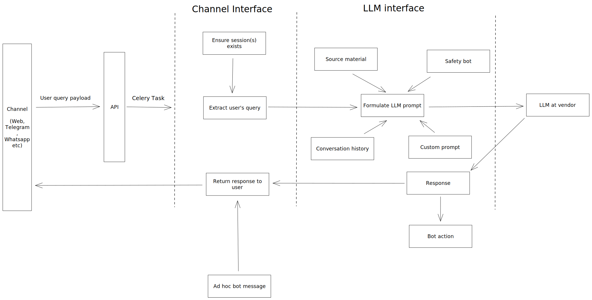

# Open Chat Studio

Experiments with AI, GPT and LLMs.

## Quick Overview


Building a bot requires setting up an `Experiment`. An experiment brings together various features and information that ultimately dictates the behavior and knowlege of the bot. The most basic experiment consists of only a prompt.

### Some Experiment Features
#### Prompt
The most basic experiment consists of a prompt. A prompt can be as simple as "You are a simple assistant" or "You are a helpful assistant." This serves as the initial instruction for your bot.

#### Temperature
The temperature parameter influences the randomness of your bot's responses. For a detailed explanation of how to use and fine-tune the temperature parameter, check out [this article.](https://www.coltsteele.com/tips/understanding-openai-s-temperature-parameter)
#### Source Material
If you have specific material that you want your bot to draw knowledge from, you can create source material within your experiment. This allows your bot to answer questions and provide information based on the content you provide.

#### Safety Bots
The safety layer allows you to review user or bot messages to determine their safety. You can specify a prompt that will be used to assess the safety of the content. If the content is deemed unsafe, the bot will be prompted to formulate an appropriate response.

#### Synthetic voice
You can specify a synthetic voice for your bot. To set this up, make sure to configure the following environment variables:

```Shell
AWS_POLLY_ACCESS_KEY_ID
AWS_POLLY_SECRET_KEY
AWS_POLLY_REGION
```
This allows your bot to use a synthetic voice when responding to voice notes, provided that the user's communication channel supports them. Otherwise, the bot will respond with text.


#### No Activity Ping
Configure the activity settings to determine when your bot should prompt the user to respond. The activity config dictates the timing and frequency of these prompts, ensuring a seamless interaction with the user.
#### Agents
See the LangChain page on [Agents](https://docs.langchain.com/docs/components/agents/).


## Installation

Setup a virtualenv and install requirements
(this example uses [virtualenvwrapper](https://virtualenvwrapper.readthedocs.io/en/latest/)):

```bash
mkvirtualenv gpt_playground -p python3.11
pip install -r dev-requirements.txt
```

Python 3.11 is recommended, though anything between 3.9 and 3.11 should work.

## Set up database

Create a database named `gpt_playground`.

```
createdb gpt_playground
```

or if you're using docker, start the container with

```
docker run -d --name gpt-postgres -p 5432:5432 -e POSTGRES_PASSWORD=*** -e POSTGRES_USER=postgres -e POSTGRES_DATABASE=gpt_playground postgres:14
```
then create the DB
```
docker exec -it gpt-postgres createdb -U postgres gpt_playground
```

Create database migrations:

```
./manage.py makemigrations
```

Create database tables:

```
./manage.py migrate
```

## Running server

```bash
./manage.py runserver
```

## Building front-end

To build JavaScript and CSS files, first install npm packages:

```bash
npm install
```

Then build (and watch for changes locally):

```bash
npm run dev-watch
```

## Running Redis

Redis is needed by Celery to run background tasks.

You can set up Redis in docker using:

```bash
docker run -d -p 6379:6379 --name redis redis
```

## Running Celery

Celery can be used to run background tasks.

**Note:** Celery is needed to get a response from the LLM, so you'll need to run this if you want to test end-to-end conversations.

You can run it using:

```bash
celery -A gpt_playground worker -l INFO
```

Or with celery beat (for scheduled tasks):

```bash
celery -A gpt_playground worker -l INFO -B
```

## Updating translations

**Docker:**

```bash
make translations
```

**Native:**

```bash
./manage.py makemessages --all --ignore node_modules --ignore venv
./manage.py makemessages -d djangojs --all --ignore node_modules --ignore venv
./manage.py compilemessages
```

## Installing Git commit hooks

To install the Git commit hooks run the following:

```shell
$ pre-commit install --install-hooks
```

Once these are installed they will be run on every commit.

## Running Tests

To run tests:

```bash
./manage.py test
```

Or to test a specific app/module:

```bash
./manage.py test apps.utils.tests.test_slugs
```

On Linux-based systems you can watch for changes using the following:

```bash
find . -name '*.py' | entr python ./manage.py test apps.utils.tests.test_slugs
```


## Customizations

Copy the `.env.example` file to `.env` and set any values that you need.
You should also add your OpenAI key to this file:

```
OPENAI_API_KEY="sk-***"
```

### Testing bots

To test a bot, first create an experiment. This can be done in the Django admin.

After doing that you can use the UI to create a new chat session against the experiment.

Note that celery needs to be running and your `OPENAI_API_KEY` needs to be set in order to get responses from the bot.

You can also run experiments on the command line using:

```bash
python manage.py run_experiment <experiment_pk>
```

#### Testing bots through Channels
Telegram - To test the webhooks, you can use a tool like ngrok to forward webhook data to your local machine.
