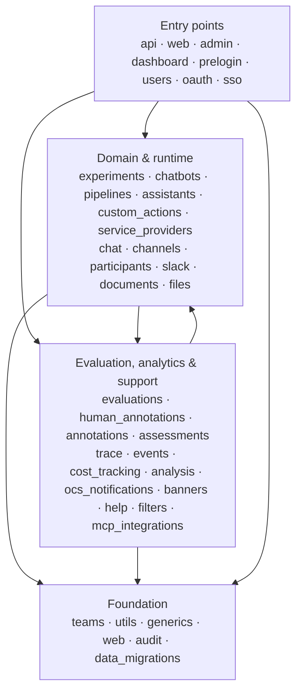

---
hide:
  - navigation
---

# Package map

A navigation map of the Django apps in `apps/` — what each is for, and which way
dependencies flow. Use it to find where a concern lives and to gauge the blast radius
of a change before making it.

This is a **role map, not a strict layering**. The import graph is a connected graph,
not an acyclic stack of layers: foundational apps are imported almost everywhere, and a
few apps import very widely. The direction below describes the *dominant* flow, not an
invariant the code never crosses — that is why there is no import-linter contract
enforcing it (see the note at the end).

## Dependency direction

Dependencies flow downward: entry points depend on domain apps, which depend on the
foundation. The foundation depends on nothing above it.

## Tiers

### Foundation
Cross-cutting infrastructure imported almost everywhere. Changes here have the widest
blast radius.

| App | Responsibility |
|-----|----------------|
| `teams` | Multi-tenancy root — `BaseTeamModel`, team middleware, auth decorators/mixins. See [multi-tenancy guide](../agents/multi_tenancy.md). |
| `utils` | Shared base models (`BaseModel`), custom fields, factories, helpers. |
| `generics` | CRUD view/table scaffolding (`make_crud_urls`, generic actions). |
| `web` | Base views, shared page chrome, health checks. |
| `audit` | Field-level audit logging. |
| `data_migrations` | Long-running/managed data migrations. |

### Domain & runtime
The chatbot model and the machinery that runs conversations.

| App | Responsibility |
|-----|----------------|
| `experiments` | The `Experiment` (a.k.a. Chatbot) model, versioning, sessions. Imported by 27 apps. |
| `chatbots` | Chatbot-facing UI layer over `experiments`. |
| `pipelines` | DAG workflow definition and runtime (LLM/router/custom-action nodes). |
| `assistants` | OpenAI Assistants integration. |
| `custom_actions` | HTTP API wrappers (OpenAPI schema) callable from pipelines. |
| `service_providers` | Credentials + `LlmService`/`MessagingService` abstractions for LLM, messaging, voice, tracing. |
| `chat` | `Chat`/message models and history. |
| `channels` | Platform integration + webhook routing (Telegram, WhatsApp, Slack, API, web, email, Connect). |
| `participants` | Participant identity across channels. |
| `slack` | Slack platform app (events, install/OAuth). |
| `documents` | Document/collection management for retrieval. |
| `files` | File storage and access. |

### Evaluation, analytics & support
Features layered on top of the domain, plus supporting services.

| App | Responsibility |
|-----|----------------|
| `evaluations` | Evaluation configs, runs, and datasets. |
| `human_annotations` | Reviewer annotation queues and consensus. See [ADR-0015](../adr/0015-human-annotations-app-with-queue-item-annotation-aggregate-model.md). |
| `annotations` | Tags and comments attached to domain objects (imported widely). |
| `assessments` | Lean `Score` value layer. See [ADR-0012](../adr/0012-score-value-layer-in-apps-assessments.md). |
| `trace` | `Trace`/`Span` observability records for requests and pipeline steps. |
| `events` | Event triggers and scheduled actions. |
| `cost_tracking` | LLM usage and cost accounting. |
| `analysis` | Analysis pipelines over conversation data. |
| `ocs_notifications` | In-app notifications. |
| `banners` | Site banners. |
| `help` | In-app help / help agents. |
| `filters` | Reusable list-filter definitions. |
| `mcp_integrations` | Model Context Protocol integrations. |

### Entry points
Top of the stack — nothing imports these; they wire the domain to the outside world.

| App | Responsibility |
|-----|----------------|
| `api` | DRF REST API (`/api/`) + OpenAI-compatible endpoints. See [API versioning ADRs](../adr/0022-url-path-api-versioning.md). |
| `web` | Server-rendered web UI (also foundational for shared chrome). |
| `admin` | Staff-only admin area. |
| `dashboard` | Analytics dashboard. |
| `prelogin` | Public marketing pages. |
| `users` · `oauth` · `sso` | Authentication and account management. |

## Blast radius

These apps are dependency magnets — a large fraction of the codebase imports them, so
changes ripple widely. Treat their public surfaces as contracts and lean on the guard
tests when touching them:

| App | Imported by (# apps) | Guarded by |
|-----|----------------------|------------|
| `teams` | ~35 | `apps/teams/tests/test_multitenancy_guards.py`, `test_view_auth_guard.py` |
| `utils` | ~29 | — |
| `experiments` | ~27 | model versioning tests |
| `service_providers` | ~23 | — |
| `chat`, `web`, `channels`, `annotations`, `generics` | ~17–18 | — |

## Why no import-linter contract

An `import-linter` layering contract was considered but rejected: the tool's current
release forces a downgrade of a runtime dependency (`typer`, pulled in by `taskbadger`
and `transformers`) to resolve, which is not worth it for a dev-only check. The import
graph is also genuinely cyclic between the domain and feature tiers, so a strict
layering contract would not hold without extensive `ignore_imports` exceptions. The
existing [`scripts/check_inline_imports.py`](https://github.com/dimagi/open-chat-studio/blob/main/scripts/check_inline_imports.py)
guard already covers the one import rule that *is* mechanically enforced (no unjustified
function-level imports).
