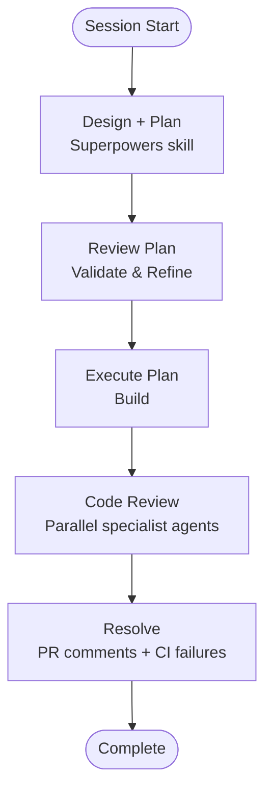

# AI-Assisted Development

This project supports AI-assisted development workflows using Claude Code.

Our shared Claude workflows, commands, and configuration are maintained in the [dimagi-claude-workflows](https://github.com/dimagi/dimagi-claude-workflows) repository. Refer to that repository for setup instructions and usage guidance.

## Development Workflow

The following is the typical development flow we use when working with Claude Code on this project.

