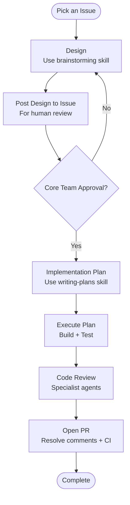

# AI-Assisted Development

This project uses an agentic development workflow built around [Claude Code](https://docs.anthropic.com/en/docs/claude-code/overview). Other agentic coding tools (Codex, opencode, etc.) can follow the same process.

Our shared Claude workflows, commands, and configuration are maintained in the [dimagi-claude-workflows](https://github.com/dimagi/dimagi-claude-workflows) repository. Refer to that repository for setup instructions and usage guidance.

## Recommended Workflow

The core principle is **design before code**. Every non-trivial change should go through a design phase where the approach is reviewed by the core team before implementation begins.



### 1. Design

When starting work on an issue, use your agentic coding tool to explore the codebase and produce a design document. In Claude Code, the `brainstorming` skill guides this process — it helps you understand the problem, explore approaches, and arrive at a concrete design.

The design should cover:

- What problem is being solved and why
- The chosen approach and alternatives considered
- Key technical decisions and trade-offs
- How the change fits into the existing architecture

### 2. Human Review

Post the design as a comment on the GitHub issue for review by the core team. **Do not proceed to implementation until the design is approved.** This catches misunderstandings and architectural mismatches early, before time is spent writing code.

For simple bug fixes or small changes where the approach is obvious, a brief comment describing the fix is sufficient. The goal is alignment, not ceremony.

### 3. Implementation Planning

Once the design is approved, create a detailed implementation plan. In Claude Code, the `writing-plans` skill produces a step-by-step plan with file-level changes, test requirements, and dependency ordering.

### 4. Execute

Work through the implementation plan. The agentic tool handles code generation, test writing, and iterating on failures. Review the output as you go — the tool is a collaborator, not an autopilot.

### 5. Code Review and PR

Before opening a PR, run the project's linters, type checkers, and tests. Use code review agents to catch issues early. Then open a PR following the project's [pull request guidelines](../contributing/pull_requests.md).

## Setup

### Claude Code

1. Install Claude Code following the [official docs](https://docs.anthropic.com/en/docs/claude-code/overview).
2. Install the shared workflows from the [dimagi-claude-workflows](https://github.com/dimagi/dimagi-claude-workflows) repository.
3. The project's `CLAUDE.md` and `AGENTS.md` files provide project-specific context automatically.

### Other Tools

If you use a different agentic coding tool, create a symlink so it picks up the project instructions:

```bash
ln -s CLAUDE.md GEMINI.md  # or AGENTS.md, depending on your tool
```

Add the symlink to `.gitignore` — don't commit it.

## Key Skills

These are the Claude Code skills referenced in the workflow above. If your tool has equivalent capabilities, use those instead.

| Skill | Purpose |
|-------|---------|
| `brainstorming` | Explore the problem space and produce a design document |
| `writing-plans` | Create a step-by-step implementation plan from an approved design |
| `executing-plans` | Execute an implementation plan with review checkpoints |
| `test-driven-development` | Write tests first, then implement to green |
| `requesting-code-review` | Run parallel specialist agents to review your changes |
