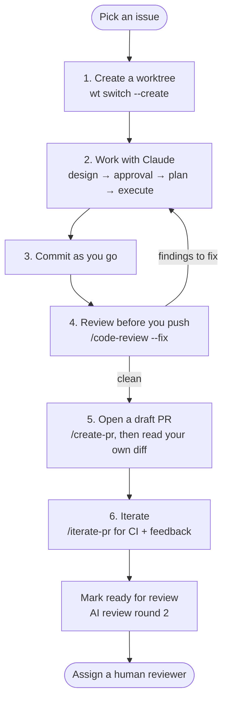

# Development Workflow

This is the loop the OCS team uses for a typical change: an isolated worktree, an agentic coding
session, logical commits, an AI code review, and a PR that is already clean by the time a human
looks at it.

The workflow is built around [Claude Code](https://docs.anthropic.com/en/docs/claude-code/overview)
and the skills in [dimagi-claude-workflows](https://github.com/dimagi/dimagi-claude-workflows/tree/main/plugins/dev_utils).
Other agentic tools can follow the same shape — see [AI Tool Setup](ai-setup.md) before you start.



## 1. Create a worktree

Each change gets its own git worktree, so several branches (and several agents) can run in
parallel without stepping on each other. We use [worktrunk](https://worktrunk.dev/) (`wt`):

```bash
wt switch --create --execute claude my-branch-name
```

That creates the branch and worktree, runs the project's setup hooks, and drops you straight into
a Claude Code session in the new directory.

!!! tip "Shell aliases"
    These three cover almost all day-to-day use:

    ```bash
    alias wtc='wt switch --create --execute claude'
    alias wtx='wt switch --create --execute codex'
    alias wts='wt switch'
    alias wtl='wt list'
    ```

    Then `wtc my-branch-name` starts Claude and `wtx my-branch-name` starts Codex after running the
    same setup. You can pass an initial prompt through: `wtc my-branch-name -- 'Fix GH #322'`.

### What worktree setup does

The hooks in `.config/wt.toml` delegate to the tool-neutral `scripts/setup-worktree.sh` and run
automatically on create:

- Copies `.env` (and `.envrc`, `.python-version`) from the main worktree, then runs
  `bootstrap.sh` to install Python and Node dependencies (`uv sync`, `pnpm install`).
- Points `DATABASE_URL` and `REDIS_URL` at a **per-branch** database and Redis DB, so a migration
  or a wiped table on one branch can't affect another. Redis database 15 stores an atomic
  allocation registry, leaving databases 1–14 for concurrent worktrees without collisions.
- Creates that database with a working superuser (`test@example.com` / `letmein`), a team, and
  sample data rather than an empty app. Migrating and seeding from scratch takes about ten
  minutes, so the finished database is kept as a PostgreSQL template per migration set and copied
  in well under a second. A branch that adds migrations copies the closest older template and
  migrates forward; only a migration set nothing has built yet pays the full cost, and the next
  worktree copies that result. Set `OCS_DISABLE_DATABASE_TEMPLATES=true` to always build from
  scratch, and `OCS_TEMPLATE_RETENTION` to keep more or fewer than three templates around.
- Builds the frontend assets.

On `wt remove` the branch database is dropped, its Redis DB is flushed, and its allocation is
released, so worktrees leave nothing behind.

Once it's set up, run [`inv dev`](local-setup.md#running-the-dev-environment) in the worktree.

## 2. Work with Claude

The core principle is **design before code**. Every non-trivial change goes through a design phase
that the core team reviews before implementation begins.

### Design

!!! tip "When to skip this"
    If the issue is already well specified, or it's small enough that the approach is obvious, skip
    straight to [plan and execute](#plan-then-execute). The goal is alignment, not ceremony — a
    design phase on a one-line bug fix is wasted effort.

Have the agent explore the codebase and produce a design document. In Claude Code the
`brainstorming` skill guides this. The design should cover:

- What problem is being solved and why
- The chosen approach, and the alternatives considered
- Key technical decisions and trade-offs
- How the change fits the existing architecture

Start by reading the [Architecture Decision Records](../adr/index.md) that touch the area you're
working in — they record decisions already made and why, so a design doesn't relitigate settled
ground. Cite them as `ADR-NNNN`. If your design contradicts one, say so explicitly rather than
quietly working around it; reversing a decision means a new superseding ADR, never an edit to an
accepted one.

### Human review

Get the design in front of the core team, and **do not start implementing until it's approved**.
This catches misunderstandings and architectural mismatches before time is spent writing code.

Where to put it depends on the size of the work:

| Size | Where |
|---|---|
| Most changes | A comment on the GitHub issue |
| Larger pieces of work | A Google Doc, linked from the issue |

A Google Doc is worth the extra step once the design is long enough that inline comment threads
get unwieldy, or when several people need to comment on different sections. Paste the agent's
markdown straight in — Google Docs will
[convert markdown on paste](https://support.google.com/docs/answer/12014036?hl=en-GB#zippy=%2Cconvert-markdown-to-google-docs-content-on-paste)
once that option is enabled, so headings, lists and tables survive.

For simple bug fixes, or changes where the approach is obvious, a brief comment describing the fix
is enough.

### Record the decisions

Once a design is settled and approved, the decisions in it should outlive the doc. Run
`/extract-adrs <source-doc>` — it pulls the durable decisions out into numbered
[ADRs](../adr/index.md), stopping to ask you which candidates are real decisions and how they
should be split or merged. See the [ADR process guide](../developer_guides/adr_process.md) for
what it automates and which calls stay yours.

Skip this for changes that didn't need a design phase — an ADR records a decision someone might
otherwise reopen in six months, not every choice made along the way.

### Plan, then execute

Once the design is approved, turn it into a step-by-step implementation plan — the `writing-plans`
skill produces one with file-level changes, test requirements and dependency ordering.
`/review-plan` from the `dev-utils` plugin gives it a pass for architecture, tests and performance
before any code is written.

Then work through it. Review and steer each step as you go — the agent is a collaborator, not an
autopilot. Use `test-driven-development` to write the tests first and implement to green.

| Skill | Purpose |
|-------|---------|
| `brainstorming` | Explore the problem space and produce a design document |
| `writing-plans` | Turn an approved design into a step-by-step implementation plan |
| `/review-plan` | Review a plan across architecture, code quality, tests and performance |
| `executing-plans` | Execute an implementation plan with review checkpoints |
| `test-driven-development` | Write tests first, then implement to green |

## 3. Commit as you go

Commit at each logical step rather than dumping the whole change at the end. Small, coherent
commits make the review in step 4 sharper, make a bad step easy to drop, and keep the eventual PR
readable.

## 4. Review before you push

Run Claude Code's built-in `/code-review` command over the working tree — no plugin needed:

```text
/code-review          # report findings
/code-review --fix    # report findings and apply them
```

Read the findings rather than accepting them wholesale — some will be wrong, and some will point
at a design problem worth going back to step 2 for. Then lint, typecheck and run the tests for
what you touched (see [Everyday commands](#everyday-commands)).

## 5. Open the PR

```text
/create-pr
```

This commits, pushes and opens the PR using the project's
[pull request template](https://github.com/dimagi/open-chat-studio/blob/main/.github/pull_request_template.md).
Open it as a **draft**.

!!! warning "Review your own PR first"
    Read your PR diff on GitHub, top to bottom, before anyone else does. The diff view surfaces
    things that are easy to miss in an editor — debug statements, stray files, a leftover
    experiment. Beyond that, ask:

    1. **Does it solve the problem you set out to solve?** Not a nearby problem, not most of it.
       Re-read the issue and check the diff against it.
    2. **Is it architected and implemented well?** Does it fit the existing patterns, sit in the
       right place, and avoid abstractions the change doesn't need?
    3. **Is the test coverage good, and do the tests add value?** Cover the behaviour and the edge
       cases, not the lines. A test that would still pass with the logic removed is worse than no
       test — it costs maintenance and buys nothing.

    **This is the single highest-value step in the list.**

## 6. Iterate until it's clean

```text
/iterate-pr
```

This picks up CI failures and reviewer comments on the current branch's PR and pushes fixes. Pass
`--dry-run` to see what it would do first.

### Fixes that happen for you

Don't hand-fix these — the [Update Generated Files](https://github.com/dimagi/open-chat-studio/blob/main/.github/workflows/update-generated-files.yml)
workflow runs on any PR touching `**.py` and commits the result back to your branch:

- Ruff safe fixes and formatting
- Regenerated API schemas (`api-schemas/*.yml`)
- Missing Django migrations

Pull before you push again, or you'll hit a conflict. Note that it does not run on PRs from forks.

### Then hand it over

1. Once the first round of fixes has landed, mark the PR **Ready for review**.
2. Wait for the second round of automated review — Claude posts inline findings on the diff, and
   Sentry flags issues from its own analysis. See
   [Claude GitHub Automation](../developer_guides/claude_github_automation.md).
3. Resolve everything the AI reviewers raised — either fix it, or reply explaining why it stands.
4. **Only then** assign a human reviewer. Their time goes on design and correctness, not on things
   a bot already found.

## Everyday commands

### Tests

```bash
uv run pytest                                  # everything
uv run pytest apps/utils/tests/test_slugs.py   # one file
```

### Linting and formatting

The project uses [ruff](https://docs.astral.sh/ruff/). Go through `inv ruff` rather than calling
`ruff` directly — it runs both the linter and the formatter in the right order and passes the
options you want by default:

```bash
inv ruff                          # check --fix + format, whole project
inv ruff --paths apps/web         # limit to a file or directory
inv ruff --no-fix                 # skip lint autofixes (still reformats)
inv ruff --unsafe-fixes           # also apply ruff's unsafe fixes
```

### Type checking

`inv typecheck` runs both checkers — [ty](https://docs.astral.sh/ty/) for Python and `tsc` for
TypeScript. Both run even if the first fails, so one invocation shows you every type error:

```bash
inv typecheck                     # both; the Python check covers apps/
inv typecheck --paths apps/web    # limit the Python check to a path
inv typecheck --python            # Python only
inv typecheck --js                # TypeScript only
```

### Dependencies

```bash
uv add <package-name>
uv add <package-name> --group [dev|prod]
inv uv                            # relock after editing pyproject.toml
```
