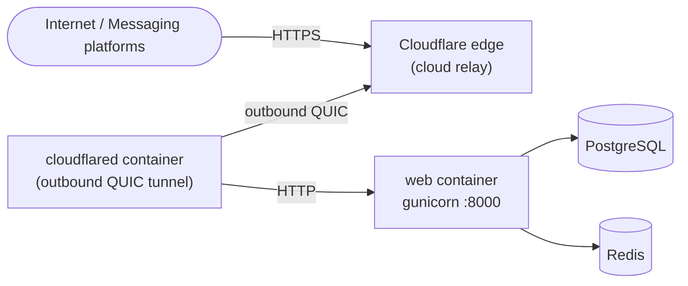
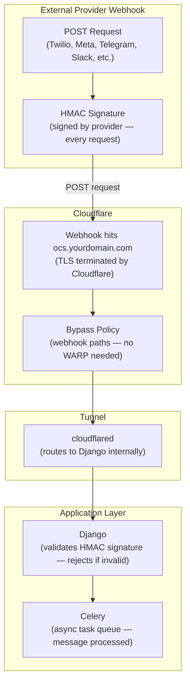
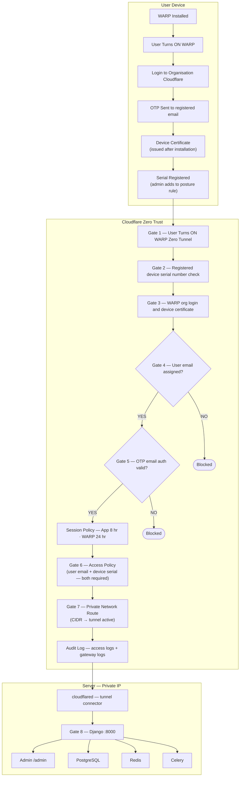

# Cloudflare Tunnel

This guide sets up [Cloudflare Tunnel](https://developers.cloudflare.com/cloudflare-one/connections/connect-networks/) as the Zero Trust access layer for Open Chat Studio. For a tool-agnostic overview and a comparison with alternatives, see [Zero Trust Access](./zero_trust_access.md).

Cloudflare Tunnel is one option for exposing Open Chat Studio without opening inbound ports. It is **not required**, if you have a public IP and a reverse proxy, skip this guide.

## How it works

`cloudflared` runs as a Docker container alongside your app. It opens outbound connections to Cloudflare's network. Cloudflare routes incoming HTTPS traffic through those connections to your `web` container. Your server never needs an inbound firewall rule.



The `cloudflared` container initiates the tunnel, your server opens no inbound ports.

## Prerequisites

- A Cloudflare account (free tier is sufficient)
- Open Chat Studio running via `docker-compose.prod.yml`

## Step 1: Create a tunnel in the Cloudflare dashboard

1. Go to **Zero Trust → Networks → Tunnels → Create a tunnel**
2. Choose **Cloudflared** as the connector type
3. Name the tunnel (e.g. `open-chat-studio-prod`)
4. Copy the tunnel token shown on screen  you will need it in Step 3

## Step 2: Configure the private hostname

The primary access method is a **private hostname** (e.g. `ocs.your-org`). This hostname is configured inside the tunnel and is only resolvable when WARP is connected  it does not appear in public DNS, certificate transparency logs, or any external registry. No domain ownership or Cloudflare DNS management is required.

In the tunnel's **Private Networks** tab:

| Field | Value |
|---|---|
| CIDR / Hostname | `ocs.your-org` (or any internal name you choose) |
| Tunnel | select your tunnel |

Then configure WARP to resolve this hostname by going to **Zero Trust → Settings → WARP Client → Local Domain Fallback** and adding `your-org` as a suffix. WARP will forward DNS queries for `*.your-org` through the tunnel.

!!! note "Fallback: private IP"
    If hostname resolution fails inside WARP during initial setup, you can also configure a CIDR route (e.g. `192.168.x.x/32`) under **Private Networks**. The same Zero Trust gates apply. Neither the hostname nor the IP is publicly accessible  both require an active WARP connection and all gates to pass.

## Step 3: Start cloudflared

The repository ships `docker-compose.cloudflare.yml` as an opt-in compose override:

```yaml
# docker-compose.cloudflare.yml
services:
  cloudflared:
    image: cloudflare/cloudflared:2025.4.0
    restart: unless-stopped
    command: tunnel --no-autoupdate run
    environment:
      - TUNNEL_TOKEN=${CLOUDFLARE_TUNNEL_TOKEN:?CLOUDFLARE_TUNNEL_TOKEN is required}
    logging:
      driver: "json-file"
      options:
        max-size: "10m"
        max-file: "3"
```

Add `CLOUDFLARE_TUNNEL_TOKEN` to your `.env.prod`:

```bash
CLOUDFLARE_TUNNEL_TOKEN=eyJ...your-token...
```

Start the stack with both compose files:

```bash
docker compose -f docker-compose.prod.yml -f docker-compose.cloudflare.yml up -d
```

The `cloudflared` service joins the same Docker network as the `web` service and can reach it by hostname.

## Step 4: Update Django settings

Add both hostnames to the trusted origins, the private hostname for WARP team access and the public hostname for webhook traffic:

```bash
# .env.prod
DJANGO_ALLOWED_HOSTS=ocs.your-org,ocs.yourdomain.com
CSRF_TRUSTED_ORIGINS=https://ocs.your-org,https://ocs.yourdomain.com
```

## Step 5: Configure Access policies

!!! warning "Required  do not skip"
    Without Access policies, the tunnel exposes your entire app to the public internet with no authentication. You **must** complete both parts of this step: protect the app with an Allow policy, and add Bypass policies for webhook paths. Skipping the Bypass policies will break all messaging integrations  external platforms (WhatsApp, Telegram, Slack, Twilio) cannot authenticate via Cloudflare Access and their webhook requests will be blocked.

### Part A: Protect the app

1. Go to **Zero Trust → Access → Applications → Add an application**
2. Select **Self-hosted**
3. Fill in the application details:
   - **Application name**: `Open Chat Studio`
   - **Application domain**: `ocs.yourdomain.com`
   - **Path**: leave blank (protects the whole domain)
4. Under **Policies**, add a policy named `Team access`:
   - **Action**: `Allow`
   - **Include rule**: Emails ending in `@yourdomain.com` (or connect an identity provider such as Google Workspace, GitHub, or Okta under **Settings → Authentication**)
5. Save the application

Users visiting `ocs.yourdomain.com` will now be redirected to a Cloudflare login page before reaching the app.

### Part B: Add Bypass policies for webhooks

Messaging platforms (WhatsApp, Telegram, Twilio, Slack) POST to your webhook endpoints directly from the internet. Unlike your team members they cannot use WARP, so they need a **public hostname**  this is the only place where a Cloudflare-managed domain is required.

### Add your domain to Cloudflare (if not already there)

If your domain is registered with an external registrar (GoDaddy, Namecheap, Route 53, Google Domains, etc.), you need to delegate DNS management to Cloudflare first:

1. In the Cloudflare dashboard, click **Add a site** and enter your domain (e.g. `yourdomain.com`)
2. Choose the **Free** plan
3. Cloudflare scans and imports your existing DNS records  review them to make sure nothing is missing
4. Cloudflare gives you two nameserver addresses, for example:
   ```text
   aria.ns.cloudflare.com
   ben.ns.cloudflare.com
   ```
5. Log in to your domain registrar and replace the existing nameservers with Cloudflare's two nameservers
6. Save and wait for propagation  typically a few minutes, up to 48 hours. Cloudflare will email you when the domain is active.

!!! note "You keep your domain registrar"
    You do **not** need to transfer your domain registration to Cloudflare. Only the nameservers need to point to Cloudflare. Your domain stays registered at GoDaddy, Namecheap, Route 53, or wherever it is  Cloudflare only takes over DNS resolution. You can switch nameservers back at any time.

Once the domain is active in Cloudflare, the public hostname configuration below will work.

### Configure the public hostname for webhooks

In the tunnel's **Public Hostnames** tab, add a route for your webhook-facing hostname:

| Field | Value |
|---|---|
| Subdomain | `ocs` (or your preferred subdomain) |
| Domain | `yourdomain.com` (must be managed by Cloudflare DNS) |
| Service type | `HTTP` |
| URL | `web:8000` |

Cloudflare will automatically create the CNAME DNS record  no manual DNS changes needed. This public hostname is only used for inbound webhook traffic; your team continues to access the app via the private hostname over WARP.

You must then add a **Bypass** policy for every webhook path so these machine-to-machine requests are not blocked by the Access policy.



Add each Bypass policy to the **same application** created in Part A:

1. Open the application → **Policies** tab → **Add a policy**
2. Set **Action** to `Bypass`
3. Under **Include**, select **Everyone**
4. Set the **Path** field to one of the paths from the table below
5. Save, then repeat for each remaining path

| Path | Platform | Notes |
|---|---|---|
| `/channels/facebook/*` | Meta / WhatsApp Cloud API | Covers Cloud API and legacy Graph webhooks |
| `/channels/telegram/*` | Telegram | Bot token verified in the URL path |
| `/channels/twilio/*` | Twilio SMS / Voice | Requests signed with HMAC-SHA1 |
| `/channels/turn/*` | Turn.io | |
| `/channels/commcare/*` | CommCare | |
| `/channels/api/*` | Generic API channel | |
| `/slack/events/` | Slack Events API | Exact path  no wildcard |
| `/slack/oauth/*` | Slack OAuth flow | |
| `/static/*` | Static assets | Required for web widget embeds on external sites |

!!! tip
    Platform-level security is unchanged. Each platform enforces its own request verification (Meta HMAC-SHA256, Telegram token in the URL, Twilio HMAC-SHA1, Slack signing secret). The Bypass policy only removes the Cloudflare Access cookie requirement for those paths.

!!! warning "Policy order matters"
    Cloudflare evaluates policies top to bottom and stops at the first match. Place all **Bypass** policies **above** the **Allow** policy in the list. If the Allow policy is evaluated first, webhook requests will be rejected before the Bypass rule is reached.

## Managing access

### Add a user

1. Go to **Zero Trust → Settings → Authentication → Manage Seats**
2. Click **Add seat** and enter the user's email address
3. The user will receive a login link the next time they visit the app

Alternatively, if your Allow policy uses an email domain rule (e.g. `@yourdomain.com`), any user with a matching email can authenticate without being added individually  no seat management needed.

### Remove a user

1. Go to **Zero Trust → Settings → Authentication → Manage Seats**
2. Find the user and click **Revoke**

Revoking a seat removes their active session immediately. If your policy uses a domain rule, also remove their email from the identity provider to prevent re-authentication.

### Change the identity provider

1. Go to **Zero Trust → Settings → Authentication → Login methods**
2. Add or remove identity providers (Google Workspace, GitHub, Microsoft, one-time PIN, etc.)
3. Update the Allow policy in the application to reference the new provider

The one-time PIN option (email magic link) works without an external IdP and is the simplest starting point.

For ongoing administration — adding and removing users, device management, session settings, audit logs, and common troubleshooting — see the [Cloudflare Zero Trust Administration guide](./cloudflare_admin.md).

## WARP device access

For teams who want device-level Zero Trust (not just browser-based login), Cloudflare WARP extends the trust chain to the device itself. This is optional but gives you posture checks  only registered, enrolled devices with valid certificates can access the app.

The diagram below shows the full trust chain from device enrolment through to the application layer.



### Enrol a device

1. Install the [Cloudflare WARP client](https://developers.cloudflare.com/cloudflare-one/connections/connect-devices/warp/download-warp/) on the device
2. In the WARP client, go to **Preferences → Account → Login with Cloudflare Zero Trust**
3. Enter your organisation name (the team domain shown in **Zero Trust → Settings → Custom Pages**)
4. Complete the OTP email verification  a device certificate is issued automatically
5. In the dashboard, go to **Zero Trust → Settings → WARP Client → Device posture** and add the device serial to your posture rule

### Add a posture rule (device serial check)

1. Go to **Zero Trust → Settings → WARP Client → Device posture → Add a rule**
2. Choose **Serial number** as the check type
3. Enter the serial number(s) of approved devices
4. Reference this posture rule in your Access policy (Gate 6) under **Require** → **Device posture**

### Session durations

| Access method | Default session |
|---|---|
| Browser (Access app) | 8 hours |
| WARP client | 24 hours |

Sessions can be adjusted under **Zero Trust → Access → Applications → your app → Session duration**.

## Verifying the setup

```bash
# cloudflared logs
docker compose -f docker-compose.prod.yml -f docker-compose.cloudflare.yml logs cloudflared

# confirm tunnel is healthy in the Cloudflare dashboard
# Zero Trust → Networks → Tunnels  status should be "Healthy"
```

Send a test message via WhatsApp or Telegram to confirm the webhook path is reachable.

## Troubleshooting

### Tunnel shows as "Inactive" or "Degraded" in the dashboard

```bash
docker compose -f docker-compose.prod.yml -f docker-compose.cloudflare.yml logs cloudflared
```

Common causes:
- `CLOUDFLARE_TUNNEL_TOKEN` is missing or incorrect in `.env.prod`
- The `cloudflared` container cannot reach `web:8000`  confirm both containers are on the same Docker network

### Webhook requests are blocked (403 Forbidden)

The messaging platform is hitting the Access policy instead of the Bypass policy. Check:

1. The Bypass policy exists for the relevant path (e.g. `/channels/facebook/*`)
2. The Bypass policy is ordered **above** the Allow policy in the application's policy list
3. The path in the Bypass policy matches exactly  `/channels/facebook/*` will not match `/channels/facebook` without the trailing slash on some platforms

### `CSRF verification failed` or `DisallowedHost`

`DJANGO_ALLOWED_HOSTS` or `CSRF_TRUSTED_ORIGINS` in `.env.prod` does not include your Cloudflare hostname. Verify both are set:

```bash
DJANGO_ALLOWED_HOSTS=ocs.your-org,ocs.yourdomain.com
CSRF_TRUSTED_ORIGINS=https://ocs.your-org,https://ocs.yourdomain.com
```

### Cloudflare returns a 502 for all requests

The tunnel is healthy but the `web` container is not responding. Check:

```bash
docker compose -f docker-compose.prod.yml logs web
```

## Upgrading cloudflared

Pin the image tag in `docker-compose.cloudflare.yml` to a specific release (as shown above). To upgrade, change the tag and pull:

```bash
docker compose -f docker-compose.prod.yml -f docker-compose.cloudflare.yml pull cloudflared
docker compose -f docker-compose.prod.yml -f docker-compose.cloudflare.yml up -d cloudflared
```

Check the [cloudflared releases page](https://github.com/cloudflare/cloudflared/releases) for the latest version.
