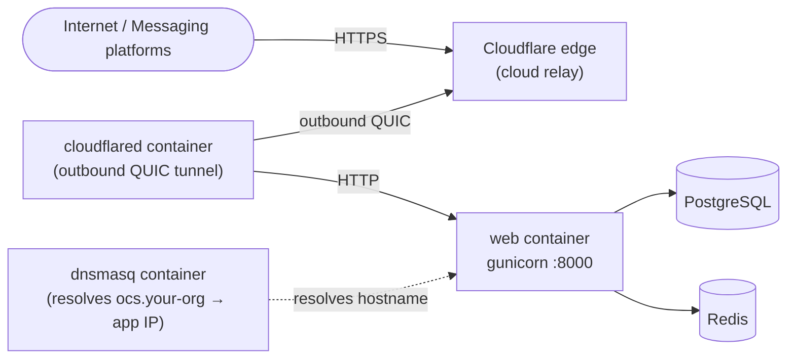
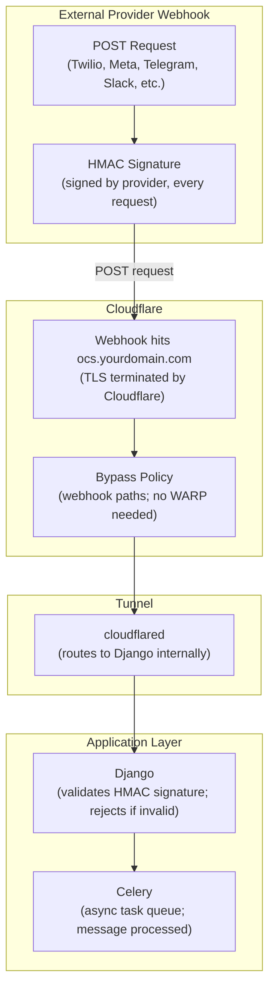

# Cloudflare Tunnel

This guide sets up [Cloudflare Tunnel](https://developers.cloudflare.com/cloudflare-one/connections/connect-networks/) as the Zero Trust access layer for Open Chat Studio. For a tool-agnostic overview and a comparison with alternatives, see [Zero Trust Access](./zero_trust_access.md).

Cloudflare Tunnel is one option for exposing Open Chat Studio without opening inbound ports. It is **not required**; if you have a public IP and a reverse proxy, skip this guide.

## How it works

`cloudflared` runs as a Docker container alongside your app. It opens outbound connections to Cloudflare's network. Cloudflare routes incoming traffic through those connections to your `web` container. Your server never needs an inbound firewall rule.

A `dnsmasq` container provides private DNS resolution so team members can access the app by hostname (e.g. `ocs.your-org`) instead of IP address. This hostname only resolves when WARP is connected; it does not appear in public DNS, certificate transparency logs, or any external registry.



The `cloudflared` container initiates the tunnel, your server opens no inbound ports.

## Prerequisites

- A Cloudflare account (free tier is sufficient)
- Open Chat Studio running via `docker-compose.prod.yml`

## Step 1: Create a tunnel in the Cloudflare dashboard
1. Go to **Zero Trust → Networks → Tunnels → Create a tunnel**
2. Name it (e.g. `open-chat-studio-prod`)
3. Select **Docker** as operating system
4. Copy your **token** - you will need it in Step 4
5. Tunnel status will show as `Inactive` until the connector starts

## Step 2: Configure tunnel routes
### Add a Private Hostname
The primary access method is a **private hostname** (e.g. `ocs.your-org`). This hostname is only resolvable when WARP is connected; it does not appear in public DNS, certificate transparency logs, or any external registry. No domain ownership or Cloudflare DNS management is required.

!!! warning "Avoid the `.local` TLD"
    The `.local` TLD is reserved for mDNS/Bonjour on macOS and Linux. Browsers may try to resolve `.local` hostnames via mDNS instead of sending them to WARP's DNS, causing silent resolution failures. Use a custom name like `ocs.your-org`, `ocs.internal`, or `ocs.lan`.

1. Navigate to **your tunnel → Routes tab**
2. Click Add route → select `Private hostname`
3. Enter hostname (e.g. `ocs.your-org`)
4. Optional: add a description
5. Save

### Add a CIDR route
The CIDR route tells WARP where to send traffic for your Docker network. Without it, DNS resolves the hostname to an IP, but WARP does not know how to reach that IP.

1. Still in **Routes → Add route → select Private CIDR**
2. On your server, find your web container's IP address:
```bash
docker inspect open-chat-studio-web-1 | grep -A 5 "IPAddress"
```

Note the IP address (e.g. `172.18.0.7`); the subnet is the /16 range (e.g. `172.18.0.0/16`)

3. Enter the CIDR (e.g. `172.18.0.0/16`)
4. Optional: add a description
5. Save

!!! note
    Use the full subnet notation (e.g. `172.18.0.0/16`), not a specific host with a wide mask (e.g. `172.18.0.7/16`). The latter works but is incorrect CIDR notation.

## Step 3: Configure Cloudflare Zero Trust
### Enable Gateway Proxy
Gateway Proxy is **required** for private hostname resolution. Without it, WARP cannot send DNS queries to your private dnsmasq container.

1. Go to **Zero Trust → Traffic policies → Traffic settings**
2. Under **Proxy and inspection**, enable **Allow Secure Web Gateway to proxy traffic**
3. Select **TCP** (required)
4. Select **UDP** (required; needed to proxy DNS queries to internal resolvers)
5. Optionally select **ICMP**
6. Save

!!! warning
    Without UDP enabled, WARP cannot forward DNS queries to your private DNS server and private hostnames will not resolve.

### Create a DNS Location
A DNS location tells Cloudflare Gateway where to receive DNS queries. Without it, private hostnames like ocs.your-org will not resolve, even with WARP connected.

1. Go to **Zero Trust → Settings → Locations**
2. Click Create a location
3. Name: Default DNS Location
4. Set as default: ✅ Yes
5. Do NOT add a network restriction; leave it empty so all WARP clients match
6. Click Create

!!! warning
    If you restrict the DNS location to a specific public IP, WARP clients will not match because they resolve DNS from Cloudflare's edge, not your public IP.

### Configure Split Tunnels
By default, WARP excludes private IP ranges from routing through the tunnel. You must remove these exclusions so WARP sends traffic to your Docker network.

1. Go to **Zero Trust → Settings → WARP Client → Device profiles → Default profile**
2. Under Split Tunnels, click Exclude
3. Remove `172.16.0.0/12` (this covers `172.18.0.0/16`, your Docker network)
4. Remove `192.168.0.0/16` if your Docker network uses that range
5. Save

!!! note
    Removing `172.16.0.0/12` means all traffic to the `172.16.x.x` – `172.31.x.x` range routes through WARP. This is usually fine since home and office networks rarely use `172.18.x.x.` If users experience issues reaching local resources on those ranges, add specific sub-ranges back to the exclude list instead.

### Configure Local Domain Fallback
Local Domain Fallback tells WARP to send DNS queries for your private hostname to your dnsmasq container instead of Cloudflare's public DNS.

1. Go to **Zero Trust → Settings → WARP Client → Device profiles → Default profile**
2. Under Local Domain Fallback, click Add
3. Domain suffix: `ocs.your-org` (match the private hostname from Step 2)
4. DNS server IP: `172.18.0.100` (the dnsmasq container IP; see Step 4)
5. Save

!!! note
    Resolver Policies (Cloudflare resolves hostnames natively without a DNS server) require an Enterprise plan. Local Domain Fallback with a self-hosted dnsmasq container works on all plans including Free.

!!! tip "Toggle WARP after profile changes"
    After changing Split Tunnels, Local Domain Fallback, or any device profile setting, users must disconnect and reconnect WARP to pick up the updated profile. Changes are not applied to connected clients automatically.

## Step 4: Start the Cloudflare services
The repository ships `docker-compose.cloudflare.yml` as an opt-in compose override. It includes two services: `cloudflared` (the tunnel connector) and dns (private DNS resolution via dnsmasq).

```yml
# docker-compose.cloudflare.yml
services:
  cloudflared:
    image: cloudflare/cloudflared:2025.4.0
    restart: unless-stopped
    command: tunnel --no-autoupdate run
    environment:
      - TUNNEL_TOKEN=${CLOUDFLARE_TUNNEL_TOKEN:?CLOUDFLARE_TUNNEL_TOKEN is required}
    networks:
      - open-chat-studio_default
    logging:
      driver: "json-file"
      options:
        max-size: "10m"
        max-file: "3"

  dns:
    image: jpillora/dnsmasq
    restart: unless-stopped
    command: --address=/${PRIVATE_HOSTNAME:-ocs.local}/${APP_IP:-172.18.0.7}
    networks:
      open-chat-studio_default:
        ipv4_address: ${DNS_IP:-172.18.0.100}

networks:
  open-chat-studio_default:
    external: true
```

### How private hostname resolution works
Private hostnames like `ocs.your-org` don't exist in public DNS. Here's the full resolution chain:

```
1. User types `ocs.your-org` in browser
2. WARP intercepts the DNS query
3. WARP checks Local Domain Fallback → matches `ocs.your-org`
4. WARP forwards DNS query to dnsmasq at `172.18.0.100` (through the tunnel)
5. dnsmasq returns `172.18.0.7` (the web container IP)
6. Browser connects to `172.18.0.7:8000`
7. WARP routes traffic through the tunnel (CIDR `172.18.0.0/16` matches)
8. Traffic reaches the web container
```

Each component has a specific role:

| Component | Role |
|---|---|
| `cloudflared` | Routes traffic between the Cloudflare edge and the Docker network. |
| `dnsmasq` | Maps `ocs.your-org` → `172.18.0.7` using private DNS resolution. |
| `Local Domain Fallback` | Configures WARP to forward DNS queries to `dnsmasq` for local/private domains. |
| `Split Tunnels` | Ensures traffic for `172.18.0.0/16` is routed through WARP instead of the public internet. |
| `CIDR Route` | Informs WARP that Docker network traffic should be sent through the Cloudflare tunnel. |
| `Gateway Proxy (UDP)` | Allows WARP to forward DNS queries over UDP to private/internal IP addresses. |

### Find your Docker network name
The Cloudflare compose file uses `open-chat-studio_default` as an external network. This must match the network created by your app's compose file. Find it:
```bash
docker network ls | grep default
```

Update `open-chat-studio_default` in `docker-compose.cloudflare.yml` to match the actual name if different.

### Find your web container IP
The `APP_IP` variable must match the web container's IP on the Docker network:
```bash
docker inspect open-chat-studio-web-1 | grep -A 5 "IPAddress"
```

Set this in your `.env` file.

### Configure environment variables
Add to your `.env.prod` (or create a separate .env for the Cloudflare compose):

```bash
# Cloudflare Tunnel
CLOUDFLARE_TUNNEL_TOKEN=eyJ...your-token...
PRIVATE_HOSTNAME=ocs.your-org
APP_IP=172.18.0.7
DNS_IP=172.18.0.100
```

### Start the stack
```bash
# Start the app first (creates the network)
docker compose -f docker-compose.prod.yml up -d

# Start the Cloudflare services (joins the network)
docker compose -f docker-compose.cloudflare.yml --env-file .env.prod up -d
```

Verify both containers are running:
```bash
docker compose -f docker-compose.cloudflare.yml logs
```

You should see dnsmasq report using `nameserver 1.1.1.1#53` and read `/etc/hosts`.

!!! warning "Remove the exposed port from docker-compose.prod.yml"
    The default `docker-compose.prod.yml` includes `ports: "8000:8000"` on the `web` service. This makes the app accessible at `http://your-server-ip:8000` directly, bypassing Zero Trust entirely. Remove or comment out the `ports` mapping:

    ```yaml
    web:
      <<: *app
      # ports:                          # ← remove these two lines
      #   - "${PORT:-8000}:${PORT:-8000}"  # ← remove these two lines
    ```

    The tunnel handles all access. No inbound ports are needed.

## Step 5: Update Django settings

Add the private hostname to the trusted origins. If you also configure a public hostname for webhooks (see Step 6), add that too:

```bash
# .env.prod
DJANGO_ALLOWED_HOSTS=ocs.your-org,ocs.yourdomain.com
CSRF_TRUSTED_ORIGINS=https://ocs.your-org,https://ocs.yourdomain.com
```

## Verify access

With WARP connected, verify both access methods:

- **Private hostname**: `http://ocs.your-org:8000`
- **CIDR fallback**: `http://172.18.0.7:8000`

!!! note "Why port 8000?"
    Browsers default to port 80. Since the Django app runs on port 8000 and there is no reverse proxy in front of it, you must include `:8000` in the URL. If you want `ocs.your-org` (without the port) to work, add an nginx reverse proxy to `docker-compose.cloudflare.yml` that listens on port 80 and forwards to `web:8000`.

!!! note "\"Not Secure\" label on private hostnames"
    Browsers show **Not Secure** for `http://ocs.your-org:8000` because the URL uses HTTP. This is expected and not a security gap. Private hostname traffic is encrypted end-to-end by WARP's TLS 1.3 tunnel; the browser cannot see that encryption layer, so it falls back to labelling the connection by the application-layer scheme (HTTP). The actual data in transit is protected.

    If a green padlock is required (e.g. for regulatory compliance or user-facing deployments), use a public hostname on a Cloudflare-managed domain instead. Cloudflare terminates TLS at the edge and issues a certificate automatically; the browser sees HTTPS and shows the padlock.

## Step 6: Configure Access policies

!!! warning "Required - do not skip"
    Without Access policies, anyone with WARP connected can reach your app with no authentication. You **must** complete both parts of this step: protect the app with an Allow policy, and add Bypass policies for webhook paths. Skipping the Bypass policies will break all messaging integrations; external platforms (WhatsApp, Telegram, Slack, Twilio) cannot authenticate via Cloudflare Access and their webhook requests will be blocked.

### Part A: Protect the app
1. Go to **Zero Trust → Access → Applications → Add an application**
2. Select **Self-hosted**
3. Fill in the application details:
    - **Application name**: `Open Chat Studio`
    - **Application domain**: `ocs.your-org` (your private hostname)
    - **Path**: leave blank (protects the whole domain)
4. Under **Policies**, add a policy named `Team access`:
    - Action: `Allow`
    - Include rule: Emails ending in `@yourdomain.com` (or connect an identity provider such as Google Workspace, GitHub, or Okta under **Settings → Authentication**)
5. Save the application

Users visiting `ocs.your-org` will now be redirected to a Cloudflare login page before reaching the app.

### Part B: Add Bypass policies for webhooks
Messaging platforms (WhatsApp, Telegram, Twilio, Slack) POST to your webhook endpoints directly from the internet. Unlike your team members they cannot use WARP, so they need a **public hostname**; this is the only place where a Cloudflare-managed domain is required.

#### Add your domain to Cloudflare (if not already there)
If your domain is registered with an external registrar (GoDaddy, Namecheap, Route 53, Google Domains, etc.), you need to delegate DNS management to Cloudflare first:

1. In the Cloudflare dashboard, click **Add a site** and enter your domain (e.g. yourdomain.com)
2. Choose the **Free** plan
3. Cloudflare scans and imports your existing DNS records; review them to make sure nothing is missing
4. Cloudflare gives you two nameserver addresses, for example:
```bash
aria.ns.cloudflare.com
ben.ns.cloudflare.com
```
5. Log in to your domain registrar and replace the existing nameservers with Cloudflare's two nameservers
6. Save and wait for propagation, typically a few minutes, up to 48 hours. Cloudflare will email you when the domain is active.

!!! note "You keep your domain registrar"
    You do **not** need to transfer your domain registration to Cloudflare. Only the nameservers need to point to Cloudflare. Your domain stays registered at GoDaddy, Namecheap, Route 53, or wherever it is; Cloudflare only takes over DNS resolution. You can switch nameservers back at any time.

Once the domain is active in Cloudflare, the public hostname configuration below will work.

#### Configure the public hostname for webhooks
In the tunnel's **Public Hostnames** tab, add a route for your webhook-facing hostname:

| Field | Value |
|---|---|
| Subdomain | `ocs` (or your preferred subdomain) |
| Domain | `yourdomain.com` (must be managed by Cloudflare DNS) |
| Service type | `HTTP` |
| URL | `web:8000` |

Cloudflare will automatically create the CNAME DNS record; no manual DNS changes needed. This public hostname is only used for inbound webhook traffic; your team continues to access the app via the private hostname over WARP.

You must then add a **Bypass policy** for every webhook path so these machine-to-machine requests are not blocked by the Access policy.



Add each Bypass policy to the **same application** created in Part A:

1. Open the application → **Policies** tab → **Add a policy**
2. Set **Action** to Bypass
3. Under **Include**, select **Everyone**
4. Set the **Path** field to one of the paths from the table below
5. Save, then repeat for each remaining path

| Path | Platform | Notes |
|---|---|---|
| `/channels/facebook/*` | Meta / WhatsApp Cloud API | Covers Cloud API and legacy Graph webhooks |
| `/channels/telegram/*` | Telegram | Bot token verified in the URL path |
| `/channels/twilio/*` | Twilio SMS / Voice | Requests signed with HMAC-SHA1 |
| `/channels/turn/*` | Turn.io |  |
| `/channels/commcare/*` | CommCare |  |
| `/channels/api/*` | Generic API channel |  |
| `/slack/events/` | Slack Events API | Exact path; no wildcard |
| `/slack/oauth/*` | Slack OAuth flow |  |
| `/static/*` | Static assets | Required for web widget embeds on external sites |

!!! tip
    Platform-level security is unchanged. Each platform enforces its own request verification (Meta HMAC-SHA256, Telegram token in the URL, Twilio HMAC-SHA1, Slack signing secret). The Bypass policy only removes the Cloudflare Access cookie requirement for those paths.

!!! warning "Policy order matters"
    Cloudflare evaluates policies top to bottom and stops at the first match. Place all Bypass policies above the Allow policy in the list. If the Allow policy is evaluated first, webhook requests will be rejected before the Bypass rule is reached.

## Troubleshooting

### Private hostname resolves but app returns connection refused

DNS is working but the app is not reachable on the resolved IP. Check:

1. **Port is included in the URL** - browsers default to port 80, your app runs on port 8000. Use `http://ocs.your-org:8000`
2. **Web container is running** - `docker compose -f docker-compose.prod.yml logs web`
3. **`cloudflared` is on the same Docker network** - both must share `open-chat-studio_default`
