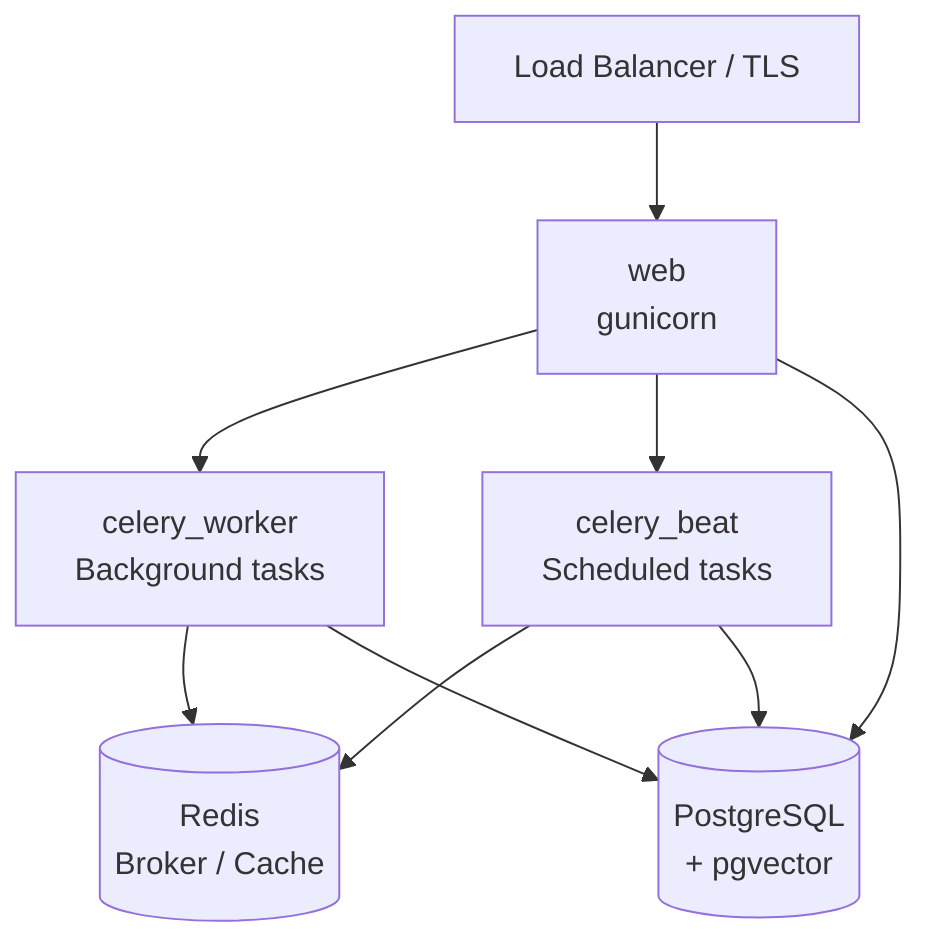

# Self-Hosting Open Chat Studio

This section covers deploying Open Chat Studio in production for third-party hosters.

## Architecture Overview

A production deployment requires three process types and two backing services:



## Infrastructure Requirements

| Component | Minimum | Notes |
|-----------|---------|-------|
| **PostgreSQL** | 14+ | Must have the [pgvector](https://github.com/pgvector/pgvector) extension (≥ 0.7.0). Use `pgvector/pgvector:pg16` Docker image or enable the extension on a managed database. |
| **Redis** | 6+ | Used as Celery broker, result backend, and Django cache. |
| **Object Storage** | Optional | AWS S3 (or compatible) for user media uploads and WhatsApp audio files. Without S3, files are stored on the local filesystem — not suitable for multi-instance deployments. |
| **Email** | Required | Mailgun or Amazon SES via [django-anymail](https://anymail.dev/). |
| **HTTPS / TLS** | Required | Terminate TLS at a reverse proxy or load balancer. The app redirects HTTP → HTTPS in production. |

## Process Types

| Process | Command | Notes |
|---------|---------|-------|
| `web` | `gunicorn --bind 0.0.0.0:$PORT --workers 2 --threads 8 --timeout 0 config.wsgi:application` | Scale horizontally. |
| `celery_worker` | `celery -A config worker -l INFO --pool gevent --concurrency 100` | Handles all async tasks (LLM calls, messaging, evaluations). |
| `celery_beat` | `celery -A config beat -l INFO` | Scheduled/periodic tasks. **Run exactly one instance.** |

## Docker Image

The production Dockerfile is a multi-stage build:

1. **Python stage** — installs dependencies via `uv` into `/code/.venv`
2. **Node stage** — compiles JS and CSS assets
3. **Runtime stage** — `python:3.13-slim-bullseye` with pre-built assets baked in

The image runs as a non-root `django` user.

```bash
docker build -t open-chat-studio:latest .
```

## Health Check

The app exposes a `/status` endpoint. Secure it by setting `HEALTH_CHECK_TOKENS` to a comma-separated list of secret tokens. Requests must include the token as a query parameter (`?token=...`).

## Deployment Options

- [Docker Compose](./docker.md) — simplest path for a single-server or small-scale deployment
- [Heroku](./heroku.md) — Platform-as-a-Service with minimal infrastructure management
- [AWS Fargate](./aws.md) — container-native deployment on AWS, with full automation via `ocs-deploy`

## First-time Setup

After deploying the database and running migrations, create a superuser:

```bash
python manage.py createsuperuser
```

You will then need to create a Team in the Django admin before the app is usable.
