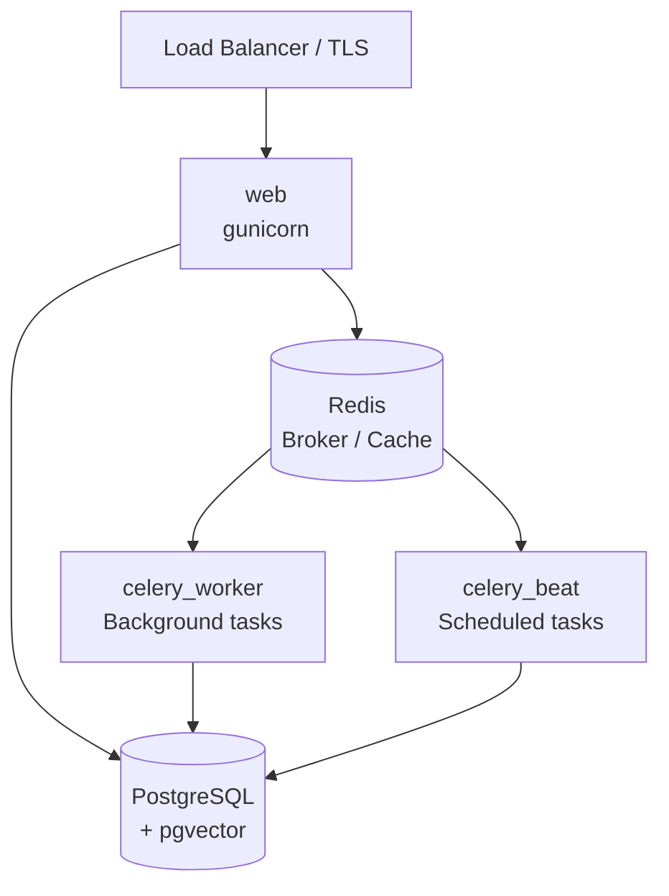

# Self-Hosting Open Chat Studio

This section covers deploying Open Chat Studio in production for third-party hosters.

## Architecture Overview

A production deployment requires three process types and two backing services:


```mermaid
flowchart TD
    LB[Load Balancer / TLS]
    WEB["web<br>gunicorn"]
    CW["celery_worker<br>Background tasks"]
    CB["celery_beat<br>Scheduled tasks"]
    PG[("PostgreSQL<br>+ pgvector")]
    RD[("Redis<br>Broker / Cache")]

    LB --> WEB
    WEB --> RD
    WEB --> PG
    RD --> CW
    RD --> CB
    CW --> PG
    CB --> PG
```

## Infrastructure Requirements

| Component | Minimum | Notes |
|-----------|---------|-------|
| **PostgreSQL** | 14+ | Must have the [pgvector](https://github.com/pgvector/pgvector) extension (≥ 0.7.0). Use `pgvector/pgvector:pg16` Docker image or enable the extension on a managed database. |
| **Redis** | 6+ | Used as Celery broker, result backend, and Django cache. |
| **Object Storage** | Optional | AWS S3 (or compatible) for user media uploads and WhatsApp audio files. Without S3, files are stored on the local filesystem — not suitable for multi-instance deployments. |
| **Email** | Required | Mailgun or Amazon SES via [django-anymail](https://anymail.dev/). |
| **HTTPS / TLS** | Required | Terminate TLS at a reverse proxy or load balancer. The app redirects HTTP → HTTPS in production. |

## Process Types

| Process | Command | Notes |
|---------|---------|-------|
| `web` | `gunicorn --bind 0.0.0.0:$PORT --workers 2 --threads 8 --timeout 0 config.wsgi:application` | Scale horizontally. |
| `celery_worker` | `celery -A config worker -l INFO --pool threads --concurrency 20` | Handles all async tasks (LLM calls, messaging, evaluations). |
| `celery_beat` | `celery -A config beat -l INFO` | Scheduled/periodic tasks. **Run exactly one instance.** |

## Task Queues

Tasks are routed to one of three queues:

| Queue | Contents |
|-------|----------|
| `celery` | Latency-sensitive chat path — inbound message handlers, event triggers, outbound bot messages. Also the default queue. |
| `background` | Long-running work — document indexing, exports, CSV imports, cleanup jobs, and evaluation coordination. |
| `evaluations` | Evaluation fan-out, which can run hundreds of LLM calls per run. |

**The single `celery_worker` command above consumes all three**, so a deployment needs no changes
to keep working. A worker started without `-Q` consumes every declared queue.

Splitting them is an optional scaling step. It's worth doing once evaluation or indexing load
starts delaying chat responses, because it stops a backed-up evaluation run from occupying every
worker thread. Replace the single worker with one process per queue:

```bash
celery -A config worker -l INFO --pool threads --concurrency 20 -Q celery
celery -A config worker -l INFO --pool threads --concurrency 10 -Q background
celery -A config worker -l INFO --pool threads --concurrency 20 -Q evaluations
```

!!! warning "Every queue needs a consumer"

    Once you pass `-Q`, each queue needs at least one running worker or its tasks will sit
    unprocessed. The `/status/celery/` healthcheck (or a per-queue `/status/queue-<name>/`
    subset) reports `No worker for Celery queue '<name>' (<queue>)` when one is unconsumed. To
    roll back, drop the `-Q` flags — workers go straight back to consuming everything.

## Docker Image

The production Dockerfile is a multi-stage build:

1. **Python stage** — installs dependencies via `uv` into `/code/.venv`
2. **Node stage** — compiles JS and CSS assets
3. **Runtime stage** — `python:3.13-slim-bullseye` with pre-built assets baked in

The image runs as a non-root `django` user.

```bash
docker build -t open-chat-studio:latest .
```

## Health Check

The app exposes a `/status/` endpoint (database, cache, and Redis checks) plus named subsets: `/status/celery/`
checks every Celery queue, and `/status/queue-<name>/` checks a single queue. Secure them by setting
`HEALTH_CHECK_TOKENS` to a comma-separated list of secret tokens. Requests must include the token as a query
parameter (`?token=...`).

## Deployment Options

- [Docker Compose](./docker.md) — simplest path for a single-server or small-scale deployment
- [Kamal](./kamal.md) — deploy Docker containers to any server via SSH with zero-downtime deploys
- [Heroku](./heroku.md) — Platform-as-a-Service with minimal infrastructure management
- [AWS Fargate](./aws.md) — container-native deployment on AWS, with full automation via `ocs-deploy`
- [Zero Trust Access](./zero_trust_access.md) — expose the app without opening inbound ports, using Cloudflare Tunnel or similar tools

## First-time Setup

After deploying the database and running migrations, create a superuser:

```bash
python manage.py createsuperuser
```

You will then need to create a Team in the Django admin before the app is usable.

## Staying Current

Deploy a tagged release rather than `main`, and watch
[Announcements](https://github.com/dimagi/open-chat-studio/discussions/categories/announcements)
so you hear about security releases. See
[Releases and Upgrades](./releases.md) for what version numbers mean, how long
each release is supported, and how to upgrade.
