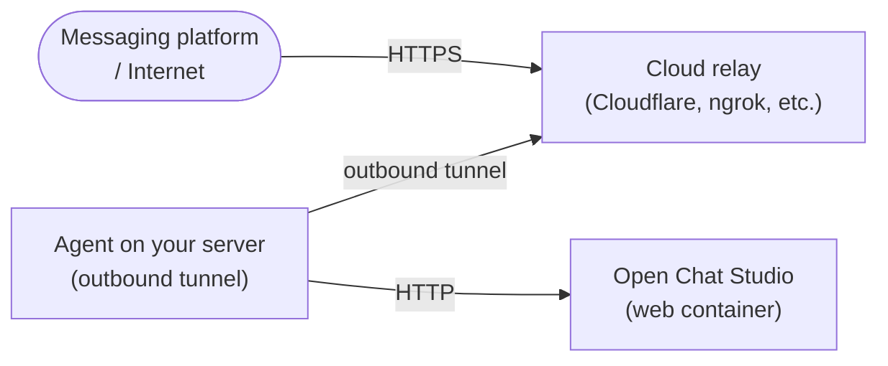

# Zero Trust Access

Zero Trust access lets you expose Open Chat Studio to the internet, including webhook endpoints for WhatsApp, Telegram, Slack, and other integrations, **without opening any inbound ports on your server**.

Instead of a public IP with firewall rules, an agent running on your server initiates an outbound-only encrypted tunnel to a cloud relay. External traffic arrives through that relay, so your server's network perimeter stays closed.

## When to use this approach

Use Zero Trust tunneling when:

- You are running Open Chat Studio on a server without a static public IP or domain.
- You want to avoid exposing the application port directly to the internet.
- You need fine-grained access control based on email addresses, identity providers, or device posture.
- You want audit logs of every access attempt.

## When you do not need it

Zero Trust access is optional. You only need it if:

- You cannot or do not want to open inbound ports (corporate firewall, ISP restriction, shared hosting)
- You want to avoid managing TLS certificates and a reverse proxy yourself
- You need messaging platform webhooks (WhatsApp, Telegram, Slack) to reach a server behind NAT or a private network

If you already run a reverse proxy (nginx, Caddy, Traefik) on a server with a public IP, you do **not** need this.

## How it works



Your server initiates the tunnel outbound, no inbound firewall rules are needed. The relay forwards incoming HTTPS traffic through the tunnel to your local web service.

## Implementation options

This is a generic pattern supported by several tools. Choose the one that fits your infrastructure:

| Tool | Tunnel protocol | Auth layer | Status |
|------|----------------|------------|--------|
| **Cloudflare Tunnel** | QUIC/HTTP2 | Cloudflare Access (OIDC, mTLS, bypass policies) | Implemented — compose file + [step-by-step guide](./cloudflare_tunnel.md) included |
| **Tailscale Funnel** | WireGuard + HTTPS | Tailscale ACLs | Not documented |
| **ngrok** | HTTP/TCP | ngrok dashboard | Not documented |
| **frp** | TCP/HTTP | Self-hosted relay | Not documented |

Only Cloudflare Tunnel has a bundled compose file and guide. The other tools work with the same application, Open Chat Studio has no dependency on the tunnel technology, but you would need to configure them yourself.

## Webhook path requirements

Regardless of which tool you use, the following paths **must** be publicly accessible without authentication headers so that external platforms can deliver webhooks:

| Path pattern | Platform |
|---|---|
| `/channels/facebook/...` | Meta / WhatsApp Cloud API |
| `/channels/telegram/...` | Telegram |
| `/channels/twilio/...` | Twilio SMS / Voice |
| `/channels/turn/...` | Turn.io |
| `/channels/commcare/...` | CommCare |
| `/channels/api/...` | Generic API channel |
| `/slack/events/` | Slack Events API |
| `/slack/oauth/...` | Slack OAuth flow |
| `/static/...` | Static assets (for widget embeds) |

Paths not in this list (the admin panel, experiment UI, API endpoints) can be protected by your access policy.

!!! warning "Keep this list up to date"
    If you add a new messaging channel or webhook endpoint to the codebase, update this table and the corresponding Bypass policy table in [Cloudflare Tunnel - Part B](./cloudflare_tunnel.md#part-b-add-bypass-policies-for-webhooks). A missing entry here will cause webhook delivery to fail silently for anyone running Zero Trust access.

    To check for recently added webhook routes, search the codebase:
    ```bash
    grep -r "path.*webhook\|webhook.*path\|channels/" apps/channels/urls.py apps/slack/urls.py
    ```

## Cloudflare Tunnel setup

See [Cloudflare Tunnel](./cloudflare_tunnel.md) for a step-by-step guide using the bundled `docker-compose.cloudflare.yml`.

## Adding other implementations

If you set up Zero Trust access with a different tool (Tailscale, ngrok, frp), the webhook path requirements and access policy patterns documented here apply equally, only the tunnel configuration steps differ.
